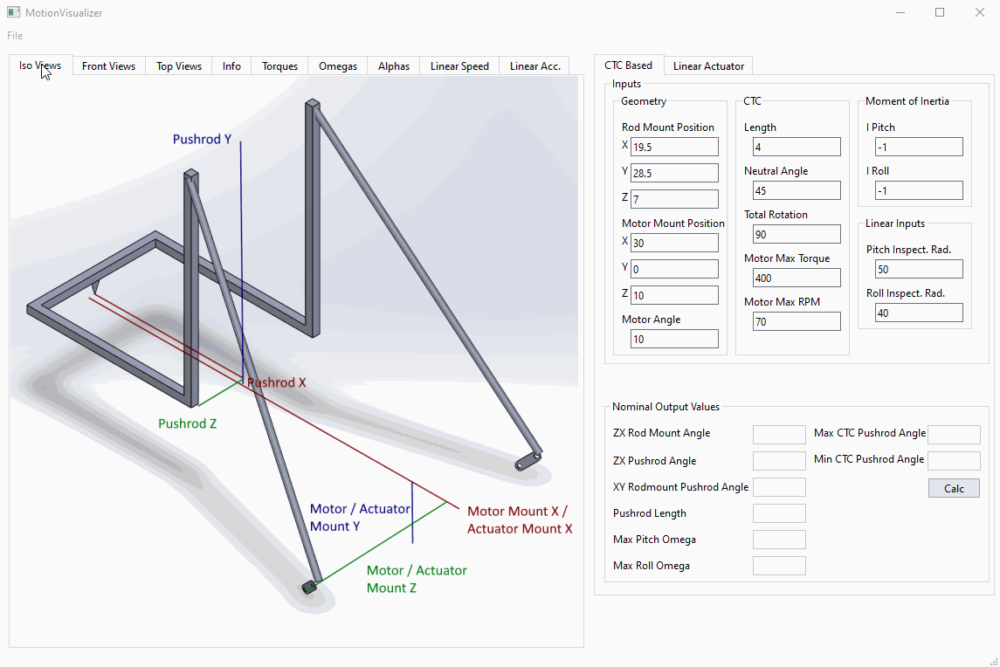

# MotionVisualizer

MotionVisualizer is a tool for doing the math involved in designing a 2 degree of freedom motion sim racing rig.
It calculates a few key parameters and generates plots for both torque and angular velocity.

## Updating UI

After updating and saving the UI in Qt Designer, with the virtual environment running, run the below code to update 
the UI file.

`$ pyside6-uic main_window.ui > main_window.py`

If images are changed in Qt Designer, in order to have them update in the app, the below code must be run within the 
virtual environment.

`$ pyside6-rcc main_window.qrc > main_window_rc.py`

## Building For Distribution

From within the virtual environment, run the below code to package the app into a single-file standalone executable:

`$ pyinstaller --name="MotionVisualizer" --windowed --onefile main.py --add-data "venv/lib/site-packages/PySide6/plugins;PySide6/plugins/`

## Change Log
### 0.0.3
* Fixed rounding bug.
* Added Pushrod Max Force.
* Added Min / Max Angles
* Added Pitch / Roll Ratio
* Clarified some labels.

### 0.0.2
* Fixed math bug.
* Added inertia to inputs.
* Added max angular speeds to outputs.
* Added Alphas tab.  
* Added pushrod length to outputs.
* Fixed plot labels.
* Added inspection radii to inputs.
* Added linear speed and acc. tabs.
* Updated Info tab.
* Added Save and Open functionality.